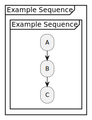

# TEL2PUML

This project converts [OpenTelemetry (OTel)](https://opentelemetry.io/) data into [PlantUML activity diagrams](https://plantuml.com/activity-diagram-beta). These diagrams are subsequently ingested by [plus2json](https://github.com/xtuml/plus2json), a tool that transforms them into JSON format. The resulting JSON 'job definitions' are specifically tailored for use with the [Protocol Verifier](https://github.com/xtuml/munin) (PV), a tool that monitors and verifies the behaviour of another system, to ensure that it is behaving as expected.

<!-- TABLE OF CONTENTS -->
<details>
  <summary>Table of Contents</summary>
  <ol>
    <li><a href="#why-use-this-tool">Why Use This Tool?</a></li>
    <li><a href="#features">Features</a></li>
    <li><a href="#quick-start">Quick Start</a></li>
    <li><a href="#example-input">Example Input</a></li>
    <li><a href="#example-output">Example Output</a></li>
    <li><a href="#installation">Installation</a>
      <ol>
        <li><a href="#manual-installation">Manual Installation</a></li>
        <li><a href="#using-devcontainer">Using Devcontainer</a></li>
      </ol>
    </li>
    <li><a href="#tel2puml-cli-documentation">TEL2PUML CLI Documentation</a></li>
    <li><a href="#technical-implementation">Technical Implementtation</a></li>
    <li><a href="#documentation">Documentation</a></li>
    <li><a href="#dependencies">Dependencies</a></li>
    <li><a href="#contributing">Contributing</a></li>
  </ol>
</details>

## Why Use This Tool?

Although this tool was designed for use with the Protocol Verifier, as a standalone application it offers several benefits for developers, system architects, and DevOps professionals:

- Visualisation of Complex Systems: Convert abstract OpenTelemetry data into clear, visual PlantUML diagrams, making it easier to understand system interactions and dependencies.

- Debugging and Troubleshooting: Quickly identify bottlenecks, errors, and unexpected behaviors in your distributed systems by visualising trace data.

- Documentation: Generate up-to-date system diagrams automatically from actual runtime data, ensuring your documentation accurately reflects the current state of your system.

- Communication: Use the generated diagrams to facilitate discussions between technical and non-technical stakeholders, improving overall project understanding.

- Performance Optimisation: Visualise request flows and timing information to identify areas for performance improvements.

- Microservices Architecture Analysis: Gain insights into how your microservices interact, helping with architectural decisions and optimisations.

- Integration with Existing Tools: As it works with OpenTelemetry data, it integrates seamlessly with your existing observability stack.

- Time-Saving: Automate the process of creating system diagrams, saving valuable development time.

- Training and Onboarding: Use generated diagrams to help new team members understand system architecture and workflows quickly.

By converting OpenTelemetry data to PlantUML diagrams, this tool bridges the gap between raw observability data and easily understandable visual representations, enhancing your ability to develop, maintain, and optimise complex distributed systems.

## Features

- CLI functionality to convert JSON PV event sequences into PlantUML activity diagrams
- Flexible, extensible architecture
- Currently in development:
  - Finding unique sequences within OTel data
  - Processing unique sequences into PlantUML activity diagrams
  - Processing alternative data formats

## Quick Start

To quickly convert a PV event sequence JSON to a PlantUML activity diagram:

1. Install the tool (see [Installation](#installation))
2. Run the following command:

```sh
python -m tel2puml your_otel_data.json -o output_diagram.puml
```

3. Open output_diagram.puml with a PlantUML viewer to see your diagram.

## Example Input (JSON PV event sequence)

```json
[
  {
    "jobId": "8077a248-95e9-4687-8d96-e2ca2638cfab",
    "jobName": "simple_sequence",
    "eventType": "A",
    "eventId": "31185642-eee0-4ab4-8aac-43f94a0bb1b7",
    "timestamp": "2023-09-25T10:58:06.059959Z",
    "applicationName": "test_file_simple_sequence"
  },
  {
    "jobId": "8077a248-95e9-4687-8d96-e2ca2638cfab",
    "jobName": "simple_sequence",
    "eventType": "B",
    "eventId": "721897bf-48f4-499d-a7a3-0a8bff783b66",
    "timestamp": "2023-09-25T10:58:06.059993Z",
    "applicationName": "test_file_simple_sequence",
    "previousEventIds": ["31185642-eee0-4ab4-8aac-43f94a0bb1b7"]
  },
  {
    "jobId": "8077a248-95e9-4687-8d96-e2ca2638cfab",
    "jobName": "simple_sequence",
    "eventType": "C",
    "eventId": "91943012-02d4-478c-bcfa-e12c5d6dc880",
    "timestamp": "2023-09-25T10:58:06.060022Z",
    "applicationName": "test_file_simple_sequence",
    "previousEventIds": ["721897bf-48f4-499d-a7a3-0a8bff783b66"]
  }
]
```

## Example Output

```sh
python -m tel2puml example_above.json -o output_diagram.puml -sn "Example Sequence"
```



## Installation

There are two ways to set up this project: manual installation or using a devcontainer (recommended).

### Manual Installation

Before proceeding with the manual installation, ensure you have the following prerequisites:

- [Anaconda](https://conda.io/projects/conda/en/latest/index.html) installed and managing the Python installation
- Python version 3.11.8 or lower
- Java runtime environment (can be installed via `apt install default-jre`)
- [Graphviz](https://graphviz.org/download/) installed

To install the project manually:

1. Set up a Python virtual environment (recommended)
2. Navigate to the project root directory
3. Run the following commands:

```bash
conda install -c conda-forge cvxopt
conda install -c conda-forge pygraphviz
./scripts/install_repositories.sh
python3.11 -m pip install -r requirements.txt
```

### Using Devcontainer

Alternatively, you can use the provided devcontainer, which manages all dependencies automatically. To use the devcontainer:

- Ensure you have Docker installed on your system
- Install the Dev Containers extension for Visual Studio Code
- Open the project folder in VS Code
- When prompted, click "Reopen in Container" or use the command palette (F1) and select "Remote-Containers: Reopen in Container"

The devcontainer will automatically set up the environment with all necessary dependencies.

## tel2puml CLI Documentation

`tel2puml` is a command-line tool for converting job JSON files to PlantUML sequence diagrams.

### Usage

```sh
python -m tel2puml [-h] [file_paths] [-fp dir] [-o file] [-sn name] [-group-by-job]
```

### Options

- `-h`, `--help`: Show this help message and exit.

- `-fp dir`, `--folder-path dir`:
  Path to folder containing job JSON files.
  Default: current directory.

- `-o file`, `--output file`:
  Output file path for the generated PlantUML file.
  Default: `./default.puml`

- `-sn name`, `--sequence-name name`:
  Name given to the PlantUML sequence diagram.
  Default: `default_name`

- `file_paths`:
  Input .json files containing job data. Multiple files can be specified.

- `-group-by-job`:
  Group events by job ID. This option doesn't take any value.

### Examples

1. Convert a folder of job JSON files to a PlantUML sequence diagram file:

```sh
python -m tel2puml -fp /path/to/folder -o /path/to/output.puml
```

2. Convert a list of job JSON files to a PlantUML sequence diagram file:

```sh
python -m tel2puml file1.json file2.json -o /path/to/output.puml
```

3. Convert a folder of job JSON files to a PlantUML sequence diagram file with a custom name:

```sh
python -m tel2puml -fp /path/to/folder -o /path/to/output.puml -sn "My Sequence Diagram"
```

4. Convert a folder of job JSON files to PlantUML sequence diagram file, grouping PV Events by job ID:

```sh
python -m tel2puml -fp /path/to/folder -o /path/to/output.puml -sn "My Sequence Diagram" -group-by-job
```

### Behaviour

- If individual file paths are provided, the tool will convert those specific files to a single PlantUML diagram.
- If the `-group-by-job` option is used, the tool will process all files in the specified folder, grouping events by job ID and outputting a PlantUML file to the specified output filepath.
- If neither individual files nor the `-group-by-job` option are specified, the tool will convert all JSON files in the specified folder (or current directory if not specified) to a single PlantUML diagram.

## Technical Implementation

To gain a better technical understanding of the project it's recommended to read the [technical implementation overview](docs/Technical_implementation_overview.md).

## Documentation

Documentation for tel2puml can be found in the [docs](docs) folder. This contains [design notes](docs/development/design), [end to end test information](docs/development/end-to-end-tests) and the [technical implementation overview](docs/Technical_implementation_overview.md).

## Dependencies

TEL2PUML depends on two other repositories:

1. [Janus](https://github.com/xtuml/janus):

   Janus ingests PUML activity diagram files and generates event sequences from them.

2. [Erebus](https://github.com/xtuml/erebus):

   Erebus is a test harness framework for the protocol verifier.

These dependencies are automatically managed when using the devcontainer setup or when running the `install_repositories.sh` script during manual installation.

## Contributing

We welcome contributions to improve tel2puml! Here's how you can contribute:

1. Fork the repository
2. Create a new branch (git checkout -b feature/amazing-feature)
3. Make your changes
4. Commit your changes (git commit -m 'Add some amazing feature')
5. Push to the branch (git push origin feature/amazing-feature)
6. Open a Pull Request
